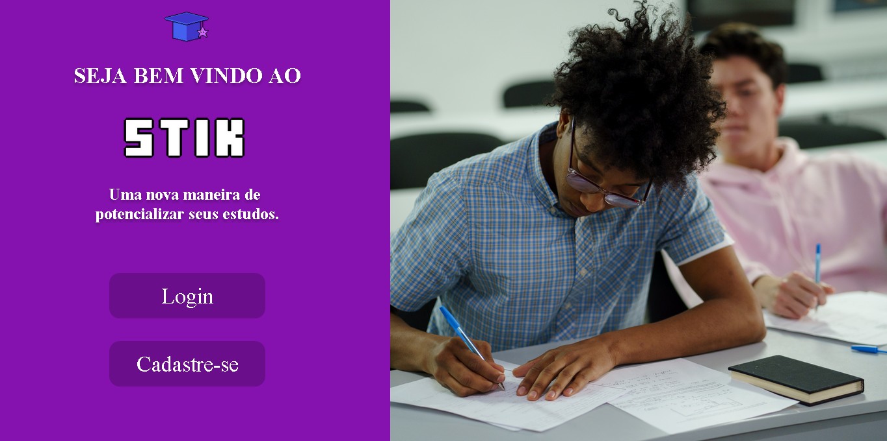
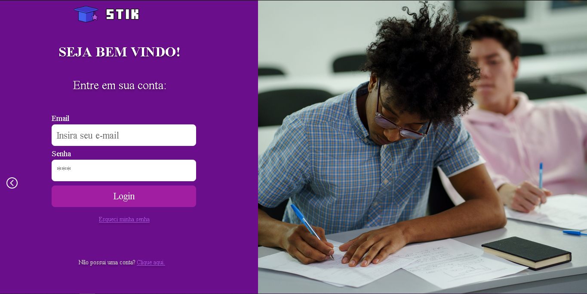
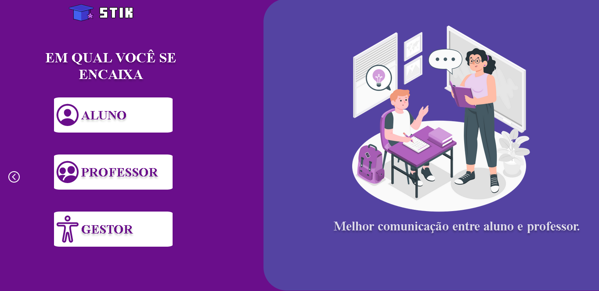
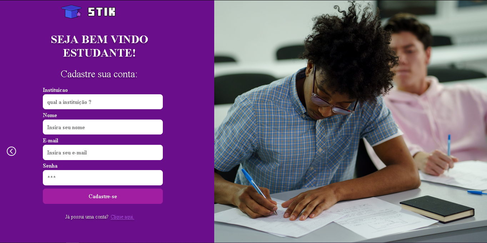

# STIK

   
  

   
  

if you want to take a look on all screens of the App, the are [Here](https://www.figma.com/proto/wanIcTDh5GAJXAiSye6eI7/Projeto-1-Goon-Website-Stik?node-id=0%3A1)

## About this Project

**The idea of the App is:**

*Let's gamify the traditional education and get one more step toward future*

## Why ?

At first, we should develop a unique function for the project, but we decide to go beyond.
So for one mouth, we learned about Html/CSS 
and decided to create a website instead use only the Prompt.

*If you would like to give us some feedback, here are my contact details.*

Email-me: [aham@cesar.school](aham@cesar.school)

Connect with me at [Linkedin](https://www.linkedin.com/in/arthur-hendrich-b30885153/)

## Observations

1. Its a new project, so we're still doing some updates.
2. You can use this Project as you wish
